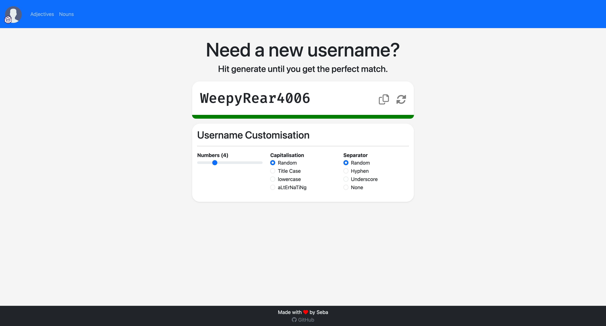

#  Username Generator

This simple web application generates unique usernames inspired by Reddit, combining adjectives and nouns.

## Demo

Check out the live demo [here](https://names.ultracore.top). Feel free to try it out and generate your own usernames!

## Features

- Easy-to-use web interface.
- Generates Reddit-style usernames on the fly.
- Responsive design powered by Bootstrap 5.

## Implementation

The generator is implemented in HTML and JavaScript, using Bootstrap 5 to provide a clean and responsive user interface.

## Credits

The word lists for adjectives and nouns are graciously provided by taikuukaits. You can find the original word lists at the following links:
- [Adjectives Common Length 3-6](https://github.com/taikuukaits/SimpleWordlists/blob/master/Wordlist-Adjectives-Common-Audited-Len-3-6.txt)
- [Nouns Common Length 3-6](https://github.com/taikuukaits/SimpleWordlists/blob/master/Wordlist-Nouns-Common-Audited-Len-3-6.txt)

## License

This project is licensed under the MIT License - see the [LICENSE](LICENSE) file for details.

## Contributing

Contributions are welcome! If you have ideas for improvement or find any issues, please open an issue or submit a pull request.